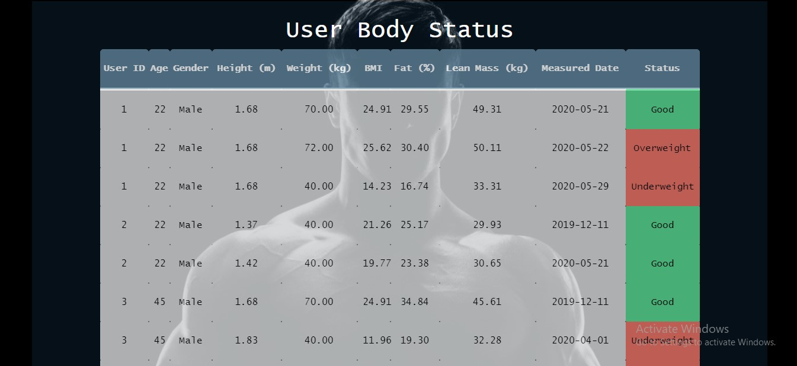
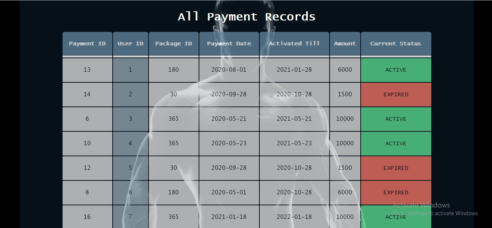
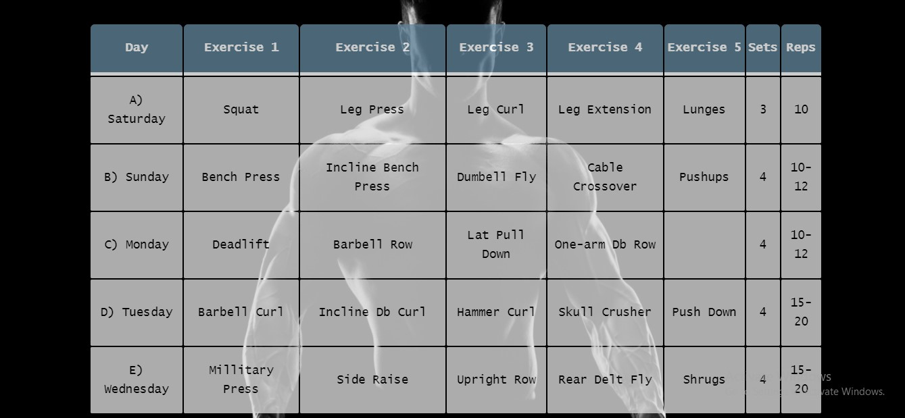
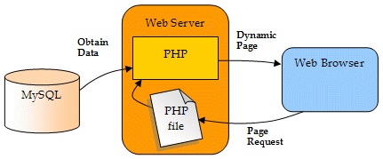

<html><body>
&nbsp;

&nbsp;

<strong></strong>

<strong>North South University</strong>

Department of Electrical &amp; Computer Engineering

<strong>Project Report</strong>

<strong>Group No</strong>: 8

<strong>Fall 2020</strong>

<strong>Project Name</strong>: Fitness 365

<strong>Course No</strong>: CSE 299 <strong>Sec</strong><strong>:</strong> 2

<strong>Faculty</strong>: Shaikh Shawon Arefin Shimon (Sas3)

<strong><u>Member </u></strong><u>:</u>

<strong>Name</strong><strong>:</strong> Md.Jushraf Rahman Chowdhury

<strong>ID</strong><strong>:&nbsp; </strong>1812901042

<strong>Email</strong><strong>:</strong> <a href="mailto:jushraf.rahman@northsouth.edu">jushraf.rahman@northsouth.edu</a>

<strong>Git Repository</strong><strong>: </strong><a href="https://github.com/NSU-FA20-CSE299-2/Group08">https://github.com/NSU-FA20-CSE299-2/Group08</a>

<strong>Date Prepared</strong><strong>: </strong>22/01/2021

<strong>&nbsp;</strong>

<strong>&nbsp;</strong>

<h1 align="center">Fitness365</h1>

<h3> Introduction:</h3></body></html>
The idea of my project is to digitalize the relationship and all the processes that happen between a gym owner/manager and its members. It will help the owner maintain all the payment records, membership details, user data, etc. all in a single platform. The member will also be able to see his current diet-chart, workout-routine, payment history, etc.
The main purpose of this system is to remove the prevalent analog system by bringing digitalized solution to improve the functionality of both users (owner & member) which will help them reach their goals in a faster calculated manner. 
<h3> Background</h3>
The fitness and bodybuilding industry in Bangladesh is currently blooming like never before. Almost 3-4 gyms are getting launched every month all over Dhaka. But sadly the existing management system of the gyms are very primitive and technologically backdated. Still now papers and pen are being used to record the registration of clients, attendance, their monthly fees, workout routines, diet charts, equipment maintenance, etc. As a result it becomes extremely tough for the manager to monitor and keep everything in sync. The clients also don’t remember to bring their workout routines every day or forget to maintain their daily diet as those papers are not always around. It creates obstruction in reaching their goals. The Gym Management has been created to remove all these hassles and make everything simple for both the manager/owner and the clients.
<h3> Purpose and Benefits</h3>

-	Viewing weekly/monthly money transactions and logistics at one go which was never possible before.
-	Providing a user-friendly system for clients to view their workout routine, diet charts and help them reach their goal faster.
-	Pointing out the unhealthy members
-	Making assessments of each client easier than ever before.
-	Reducing paperwork and manual labor, and increasing accuracy in storing and viewing information of clients, trainers, profits, earnings etc.
-	Providing transparency in maintaining the overall system of a gym.
-	Providing security to information of all the clients.

### Target Customer
Gym owners who need a well secured user-friendly application to manage everything happening in the gym by providing the most accurate results.
### Value Proposition:
This web application will reduce all the unnecessary manual labor and paperwork for the managers and reduce their burden of constantly checking everything. Clients do not also have to worry about remembering which routine or diet to follow today as everything will be automatically updated in the website. Currently there exists no web application like this in our country so it will be in a very demanding position in the market when released.
### Application Features and Description
There will be two types of login options. One for the manager and the other for the client.

##### A.	 For Manager

1.	He can store all the personal information (Name, address, medical history, contact, etc. )of the clients during admission 
2.	He can view the monthly/yearly payment history of clients 
3.	He can view the list of existing machineries and equipments.
4.	He can view which facilities (steam, sauna , cryotherapy, etc. )are provided to which clients
5.	He can set workout routine, diet chart ,supplementation for the clients
6.	He can view which trainer is in charge of which clients
7.	He can view the attendance and progress report of clients
8.	He can view the details of the employees and clerks
9.	He can view monthly/yearly income and expenditure.

##### B.	For Clients

1.	They can view their scheduled workout routine for the day
2.	They can view their scheduled diet chart
3.	They can store information of their body-part measurements ( height, weight , etc.)which will help them identify progress
4.	They can set their goal and check how far/close they are from reaching it
5.	They will be notified for any pending fees.
6.	They can submit suggestions/ complaints, etc.

### User Story
##### Use Case 1:
The manager wants to know the past and current body status of all members:
1.	He can click on ‘User Body Status’ and all the body measurement details of the users will appear.
2.	He can assign a new diet-chart to the members through ‘Set Diet Chart’ who are overweight or underweight.
3. He can assign a new workout routine to the members who are overweight or underweight through ‘Set Routine’.

##### Use Case 2: 
The manager wants to find the current payment status of all members:
1.	There are options for both checking the payment history of all users and quick checking certain users only.
2.	If he wants to check the payment history of all users he can click ‘All Payment Records’.

##### Use Case 3
The user lost his physical copy of workout routine and diet-chart manual:
1.	 He can login and view routine by clicking ‘Workout Routine’.
2.	He can view diet-chart through ‘Diet-Chart’.

### Solution Description:
The user will request files (queries) through browser. MySQL will return results from the database to the browser through php. The files will be rendered as html files by the browser.

### Tools and Resources
HTML/ CSS/ Bootstrap
PHP/ MySQL

### Challenge
There will be technical challenges of  setting up algorithm for scheduled routines/ diet charts, etc. Some changes need to be made to maintain a cyclic routine in a 7 day regime rather than the one based on day names i.e Sunday, Monday, etc. Certain changes in overall design patterns must be made to make the website more scalable. Apart from that there will be challenge on creating a user friendly design for both the manager and customer so that they do not face any complications in viewing and accessing informations.

